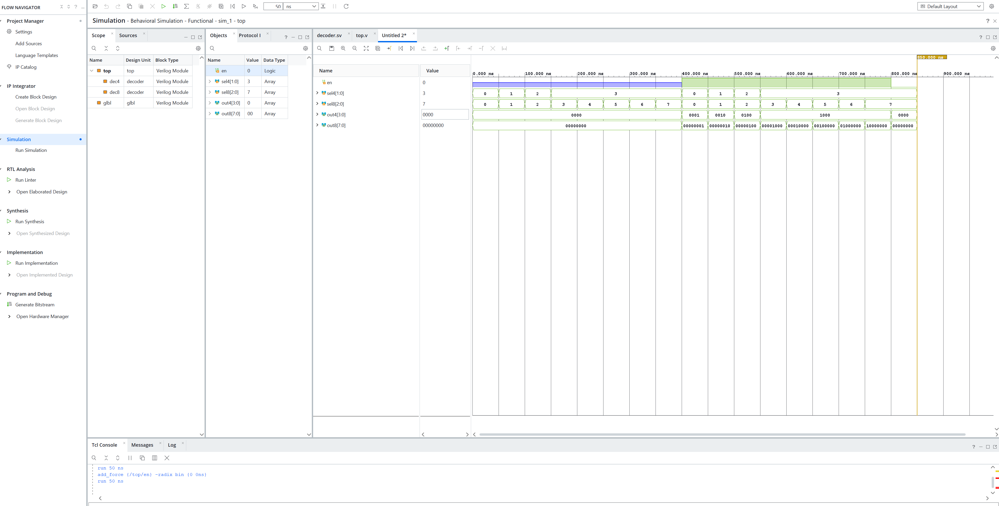

# Параметризований дешифратор (SystemVerilog, Vivado)

модуль `decoder` з параметром `WIDTH`, що перетворює двійковий
код на входi в один активний вихід серед `WIDTH`.

## Структура репозиторію

```
project_1.srcs/sources_1/new/
├── decoder.sv          -- параметризований дешифратор
└── top.sv              -- структурна обгортка з двома інстансами
project_1.xpr           -- проєкт Vivado
decoder.wcfg            -- конфігурація вікна Waveform
force_stimulus.tcl      -- послідовність Force-команд для симуляції
screenshots/            -- скріншоти симуляції
```

## Опис модуля

| Порт  | Напрямок | Розрядність        | Призначення                          |
|-------|----------|--------------------|--------------------------------------|
| `en`  | input    | 1                  | дозвіл; при `0` усі виходи нульові   |
| `sel` | input    | `$clog2(WIDTH)`    | двійковий код вибору                 |
| `out` | output   | `WIDTH`            | one-hot вектор виходів               |


## Підтвердження параметризованості

Модуль `top.sv` інстанціює **той самий** файл `decoder.sv` двічі:

```systemverilog
    decoder dec4(
        .en(en), 
        .sel(sel4),
        .out(out4)
    );
    
    decoder #(.WIDTH(8)) dec8(
        .en(en), 
        .sel(sel8),
        .out(out8)
    );
```

Обидва інстанси видно в дереві Scope симулятора.


## Результати симуляції




## Середовище

Vivado (XSim), мова опису — SystemVerilog.