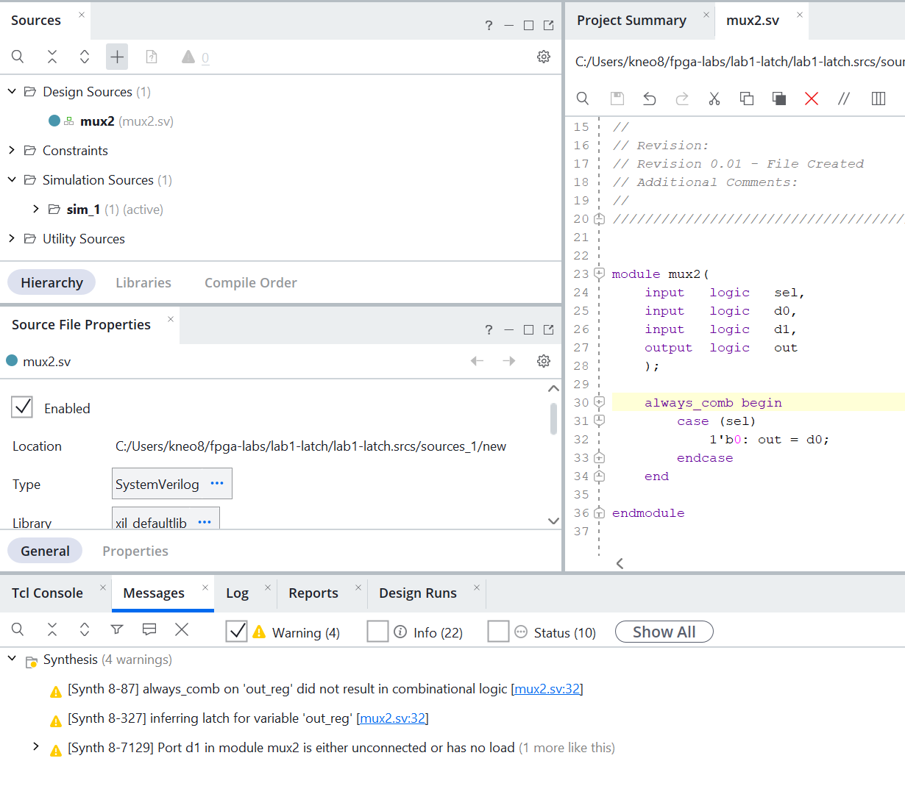
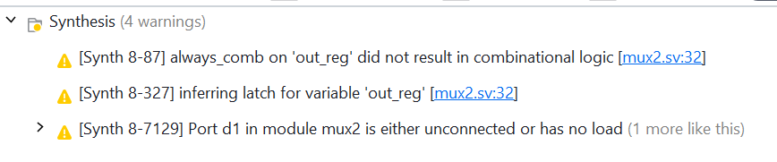
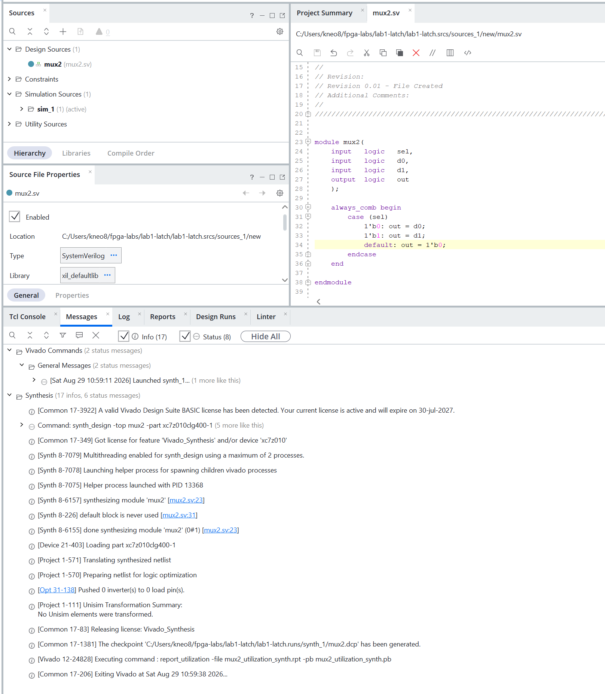

# Пошук і виправлення ненавмисного latch

Завдання 2. Навмисно створити неповний `case` у блоці `always_comb`, зафіксувати
попередження синтезатора про виведення засувки (latch), виправити код і
підтвердити, що попередження зникло.

## Структура

```
lab1-latch/
├── lab1-latch.xpr
├── lab1-latch.srcs/sources_1/new/mux2.sv
├── README.md
└── screenshots/
    ├── LatchCode.png       -- вихідний код з неповним case
    ├── Latch_Warning.png   -- попередження синтезатора
    └── Fixed.png           -- звіт синтезу після виправлення
```

Цільовий пристрій: `xc7z010clg400-1`.

## Крок 1. Код з навмисною помилкою

Мультиплексор 2-в-1, у якому описано лише один із двох варіантів `sel`:

```systemverilog
always_comb begin
    case (sel)
        1'b0: out = d0;
    endcase
end
```

Значення `sel == 1'b1` не покрите. Оскільки блок не задає `out` в усіх можливих
випадках, синтезатор змушений додати елемент пам'яті, який утримує попереднє
значення сигналу. Так і виникає ненавмисна засувка.



## Крок 2. Попередження синтезатора

Після `Run Synthesis` у вкладці Messages з'явилися такі попередження:

```
[Synth 8-87]   always_comb on 'out_reg' did not result in combinational logic [mux2.sv:32]
[Synth 8-327]  inferring latch for variable 'out_reg' [mux2.sv:32]
[Synth 8-7129] Port d1 in module mux2 is either unconnected or has no load
```




## Крок 3. Виправлення

Додано гілку для `1'b1` та `default`:

```systemverilog
always_comb begin
    case (sel)
        1'b0:    out = d0;
        1'b1:    out = d1;
        default: out = 1'b0;
    endcase
end
```

Тепер `out` отримує значення на будь-якому шляху виконання блоку, тож потреби
в елементі пам'яті немає — синтезується чиста комбінаційна логіка.

## Крок 4. Повторний синтез

Після повторного запуску категорія Warning у вкладці Messages зникла повністю —
залишилися лише повідомлення Info та Status.



Окремо варто відзначити повідомлення:

```
[Synth 8-226] default block is never used [mux2.sv:31]
```

Сигнал `sel` однорозрядний, тому гілки `1'b0` і `1'b1` вже покривають усі
синтезовані значення, і до `default` виконання не доходить. Це повідомлення має
статус Info, а не Warning. Гілку `default` все одно залишено: тип `logic` є
чотиризначним, і в симуляції сигнал може набути значень `x` або `z`