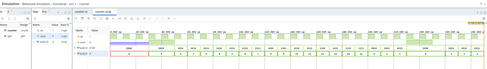

# 4-бітний лічильник з виводом на LED

Завдання 3. Модуль лічильника, що на кожному такті збільшує значення на одиницю
(0 → 15 → 0) і виводить поточне значення на 4-бітний патерн для світлодіодів.
Передбачено вхід `reset` для обнулення.

## Структура

```
lab1-counter/
├── lab1-counter.xpr
├── lab1-counter.srcs/sources_1/new/counter.sv
├── counter.wcfg            -- конфігурація вікна Waveform
├── force_stimulus.tcl      -- послідовність Force-команд
├── README.md
└── screenshots/
    └── counter_sim.png     -- результат симуляції
```

Цільовий пристрій: `xc7z010clg400-1`.

## Опис модуля

| Порт    | Напрямок | Розрядність | Призначення                          |
|---------|----------|-------------|--------------------------------------|
| `clk`   | input    | 1           | тактовий сигнал                      |
| `reset` | input    | 1           | асинхронне обнулення лічильника      |
| `led`   | output   | 4           | патерн для світлодіодів              |

```systemverilog
always_ff @(posedge clk, posedge reset) begin
    if (reset)  led <= '0;
    else        led <= led + 4'd1;
end
```

Кожен розряд `led` відповідає одному світлодіоду і одному біту двійкового запису
поточного значення лічильника.

Переповнення відбувається природним чином: розрядності вистачає рівно на
значення 0…15, тому після `1111` лічильник переходить у `0000` без додаткової
логіки порівняння.

Сброс реалізовано як **асинхронний** — сигнал `reset` присутній у списку
чутливості, тому обнулення відбувається негайно, не чекаючи фронту `clk`.
Це видно на діаграмі. Альтернативою є синхронний скид (`reset` перевіряється
лише за фронтом тактового сигналу), який у сімействах Xilinx 7-ї серії краще
лягає на апаратуру, оскільки тригери мають виділені лінії set/reset.

## Симуляція

Тестбенч не використовується — усі входи задаються вручну в XSim через Force,
згідно з умовою завдання. Тактовий сигнал формується командою `Force Clock`
з періодом 10 нс.

```tcl
add_force {/counter/reset} {1 0ns}
add_force {/counter/clk} {0 0ns} {1 5ns} -repeat_every 10ns
run 20ns

add_force {/counter/reset} {0 0ns}
run 200ns
```



Сигнал `led` виведено у вікні Waveform двічі — у двійковому та десятковому
поданні, щоб відповідність патерну до числового значення була видима напряму.

## Що підтверджує діаграма

**Початковий стан.** До подання скиду `led` має значення `xxxx`. Це коректна
поведінка: тип `logic` є чотиризначним, і тригери до першого присвоєння
перебувають у невизначеному стані. Оскільки нове значення обчислюється як
`led + 1`, невизначеність поширюється далі й зберігається до скиду. Саме тому
вхід `reset` є обов'язковим.

**Дія скиду.** При `reset = 1` вихід миттєво набуває значення `0000`, не
очікуючи фронту `clk` — підтвердження асинхронного характеру скиду.

**Рахунок.** Після зняття скиду лічильник послідовно проходить усі значення
0 → 1 → 2 → … → 15, по одному інкременту на кожен наростаючий фронт `clk`,
без пропусків.

**Переповнення.** Після `1111` (15) наступним значенням є `0000` (0) —
лічильник коректно повертається до початку циклу.

**Скид під час рахунку.** Приблизно на 240 нс `reset` подано повторно, посеред
циклу: лічильник обнулився зі значення `0010`, а після зняття скиду продовжив
рахунок з `0001`. Це підтверджує роботу скиду не лише при старті, а й у
довільний момент часу.

**Відповідність патерну.** Для кожного такту двійкове подання збігається з
двійковим записом десяткового значення: `7` ↔ `0111`, `12` ↔ `1100`,
`15` ↔ `1111`.
