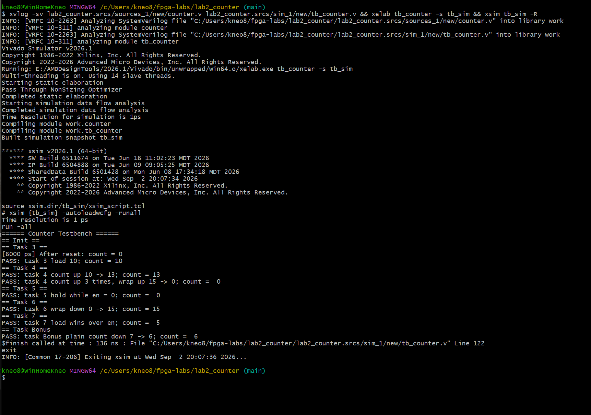
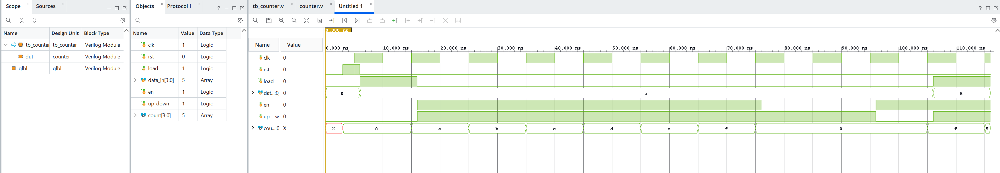

# Верифікація та Testbench: лічильник з реверсом і завантаженням

Домашнє завдання після заняття 5. Модуль 4-бітного лічильника з асинхронним
скидом, синхронним завантаженням, дозволом рахунку та вибором напрямку, а також
самоперевірний testbench до нього.

## Структура

```
lab2_counter/
├── counter.v           -- модуль лічильника
├── tb_counter.v        -- testbench із самоперевіркою
├── run_sim.sh          -- збірка та запуск симуляції
├── README.md
└── screenshots/
    ├── terminal.png    -- консольний вивід з результатами PASS/FAIL
    └── sim.png         -- вікно Waveform
```

Проєкт Vivado не використовується: завдання виконується консольними утилітами
`xvlog` / `xelab` / `xsim`.

## Модуль counter

| Порт      | Напрямок | Розрядність | Призначення                        |
|-----------|----------|-------------|------------------------------------|
| `clk`     | input    | 1           | тактовий сигнал                    |
| `rst`     | input    | 1           | асинхронний скид, активний високим |
| `load`    | input    | 1           | синхронне завантаження             |
| `data_in` | input    | 4           | значення для завантаження          |
| `en`      | input    | 1           | дозвіл рахувати                    |
| `up_down` | input    | 1           | 1 — вгору, 0 — вниз                |
| `count`   | output   | 4           | поточне значення (реєстрове)       |

Пріоритет операцій задано ланцюжком `if / else if / else if`, тому порядок
перевірки умов у коді і є порядком пріоритету:

```verilog
if (rst)        count <= 4'd0;      // asynchronous, wins over everything
else if (load)  count <= data_in;   // wins over en
else if (en)    count <= up_down ? count + 4'd1 : count - 4'd1;
// no else: count holds its value
```

Відсутність завершального `else` є навмисною — саме так виражається утримання
значення. Оскільки блок тактований, елемент пам'яті потрібен за визначенням, і
попередження про latch тут не виникає (на відміну від комбінаційних блоків, де
неповне покриття умов є помилкою).

Розрядність 4 біти, тому переповнення відбувається природним чином: 15+1 дає 0,
0-1 дає 15, без додаткової логіки порівняння.

## Testbench

Сигнали, якими керує testbench, оголошено як `reg`, вихід DUT `count` — як
`wire`. Тактовий сигнал формується генератором з періодом 10 нс:

```verilog
initial clk = 0;
always #5 clk = ~clk;
```

Усі перевірки зведено в `task automatic check_count`, який приймає очікуване
значення та назву кроку, порівнює через `===` і виводить PASS або FAIL.
Очікування тактів залишено в основному коді, оскільки кількість тактів різна
для різних кроків.

Після кожного фронту стоїть затримка `#1`. Вона потрібна тому, що присвоєння
всередині лічильника є неблокуючим: у момент самого фронту нове значення ще не
записане, і без затримки перевірка прочитала б попереднє.

## Перелік перевірок

| Крок  | Що перевіряється                          | Очікування |
|-------|-------------------------------------------|------------|
| 3     | завантаження значення                     | 10         |
| 4     | рахунок вгору 10 → 13                     | 13         |
| 4     | рахунок вгору через межу 15 → 0           | 0          |
| 5     | утримання значення при `en = 0`           | 0          |
| 6     | рахунок вниз через межу 0 → 15            | 15         |
| 7     | пріоритет `load` над `en`                 | 5          |
| Бонус | звичайний рахунок вниз 7 → 6, без межі    | 6          |

Крок 7 навмисно встановлює `load` і `en` одночасно: результат 5 підтверджує, що
завантаження має вищий пріоритет, ніж лічба.

Бонусний крок перевіряє неграничний випадок — щоб переконатися, що лічильник
працює не лише на межах діапазону.

## Запуск

```bash
./run_sim.sh          # консольний режим, вивід PASS/FAIL
./run_sim.sh gui      # відкриває Waveform у XSim
```

Еквівалентні команди вручну:

```bash
xvlog -sv counter.v tb_counter.v
xelab tb_counter -s tb_sim
xsim tb_sim -R
```

Прапорець `-sv` є обов'язковим: testbench використовує тип `string` у параметрі
task, який належить до SystemVerilog, тоді як файли мають розширення `.v`.

## Результат



Усі перевірки завершуються результатом PASS.

## X-стан у Wave window



До подання скиду сигнал `count` перебуває у стані X.

Причина: регістр `count` не має визначеного значення до першого присвоєння, а
поки `rst`, `load` і `en` неактивні, жодна гілка не спрацьовує, тому навіть
фронт такту не виводить його з невизначеного стану.