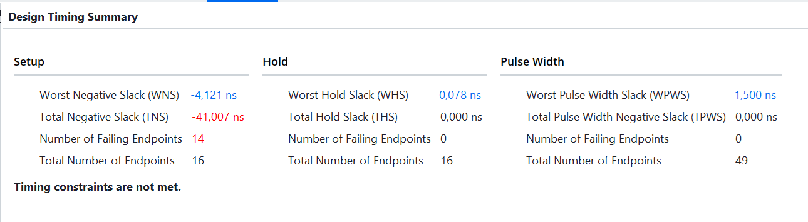
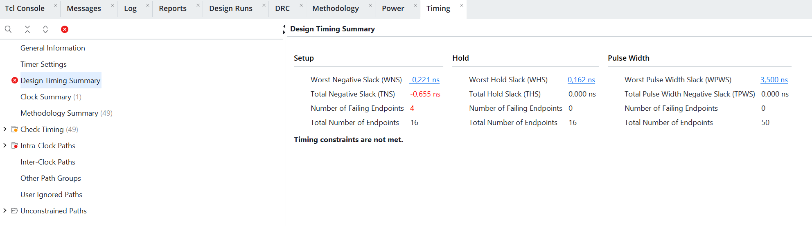
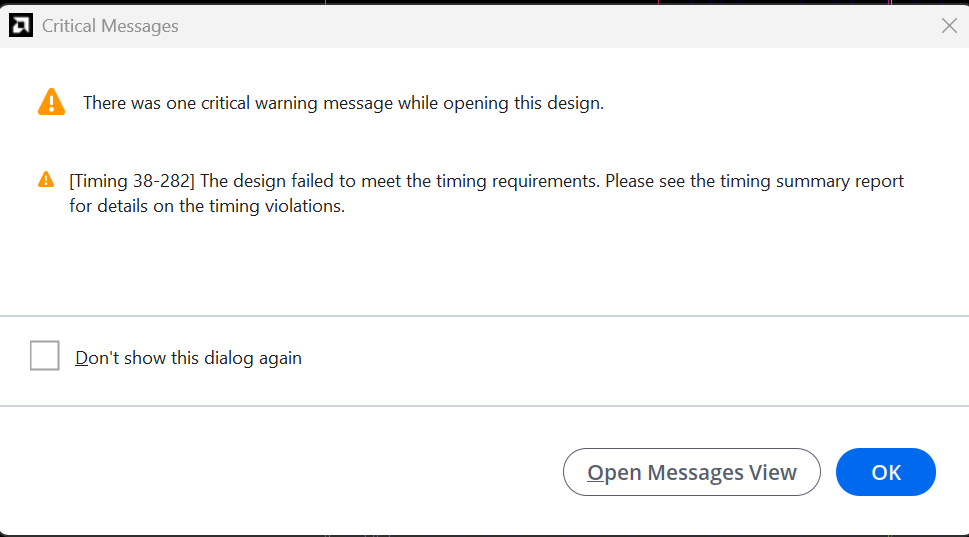
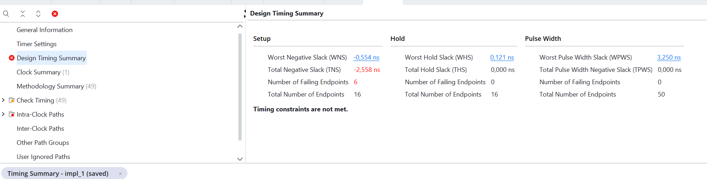
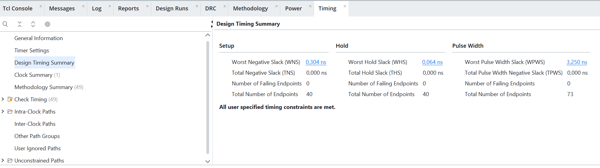

# Неконвеєризований і конвеєризований варіант: порівняння WNS

Частина 3 домашнього завдання після заняття 7. Один і той самий вираз реалізовано
у двох варіантах — без конвеєра і з одним проміжним регістром — та проаналізовано,
як розрізання довгого комбінаційного шляху впливає на запас за часом.

Обчислюваний вираз: `((a + b) * c) - d`, входи 8-розрядні, результат 16-розрядний.

## Структура

```
lab3_Expr/
├── Expr.xpr                                              -- проєкт Vivado
├── Expr.srcs/sources_1/imports/Downloads/
│   ├── expr_plain.v                                      -- без конвеєра
│   └── expr_pipelined.v                                  -- з проміжним регістром
├── Expr.srcs/constrs_1/imports/Downloads/expr_plain.xdc  -- констрейнт (спільний)
├── README.md
└── screenshots/
    ├── timing_4n.png            -- підбір періоду: 4 нс
    ├── timing_8n.png            -- підбір періоду: 8 нс
    ├── criticalMessage_4n.png   -- попередження Vivado про невиконані вимоги
    ├── screenshot_before.png    -- expr_plain, період 7,5 нс
    └── screenshot_after.png     -- expr_pipelined, період 7,5 нс
```

Обидва варіанти живуть в одному проєкті. Для отримання другого результату
топ-модуль перемкнено з `expr_plain` на `expr_pipelined`, а неактивний файл
переведено в `Disabled Sources` — він залишається в проєкті, але не бере участі
в синтезі. Період у `.xdc` при цьому **не змінювався**: порівняння має сенс лише
за однакової тактової частоти.

У закоміченому стані проєкту активним є `expr_pipelined`.

## Реєстрові входи

Обидва модулі спершу защіпують входи у власні регістри (`a_reg`, `b_reg`,
`c_reg`, `d_reg`) і далі працюють лише з ними.

Це не стильова примха, а необхідна умова аналізу. Якби входи йшли просто в
комбінаційну логіку, шлях «пін → перший регістр» не мав би часового означення:
Vivado не знає, коли саме дані з'являються на піні. Такий шлях вважається
неограниченим, і Timing Summary показав би `WNS = inf` замість числа, а на
вкладці Methodology з'явилася б категорія Unconstrained Paths.

З реєстровими входами всі шляхи стають регістр → регістр, і одного рядка
констрейнта достатньо:

```tcl
create_clock -period 7.500 -name sys_clk [get_ports clk]
```

## Підбір періоду

Мета — знайти період, за якого `expr_plain` не вкладається в вимоги, але
порушення невелике (в межах -0,5…-1 нс).

| Період  | WNS        | TNS         | Failing endpoints | Затримка шляху |
|---------|------------|-------------|-------------------|----------------|
| 4,0 нс  | -4,121 нс  | -41,007 нс  | 14 з 16           | 8,121 нс       |
| 8,0 нс  | -0,221 нс  | -0,655 нс   | 4 з 16            | 8,221 нс       |
| 7,5 нс  | -0,554 нс  | -2,558 нс   | 6 з 16            | 8,054 нс       |

Затримку критичного шляху обчислено як різницю періоду й WNS.





За такого налаштування Vivado виводить попередження про невиконані вимоги —
це очікуваний результат, а не помилка конфігурації:



**Спостереження.** Затримка критичного шляху не є сталою: 8,121 / 8,221 / 8,054 нс
за трьох різних періодів. Констрейнт не лише вимірює схему — він впливає на те,
наскільки старанно інструмент її оптимізує. За м'якої вимоги (8 нс) шлях вийшов
найдовшим, за жорсткої (7,5 нс) — найкоротшим.

**Різниця між WNS і TNS.** WNS описує лише найгірший шлях, тому при переході з
4 нс на 8 нс він змінився вчетверо, а TNS — у 60 разів, і кількість порушених
кінцевих точок упала з 14 до 4. WNS відповідає на питання «наскільки поганий
найгірший шлях», TNS і failing endpoints — на питання «скільки шляхів у біді».

## Результати за періоду 7,5 нс

### expr_plain — без конвеєра



Уся комбінаційна логіка (додавання, множення, відніманняч) лежить між
реєстровими входами та вихідним регістром одним куском:

```verilog
result <= ((a_reg + b_reg) * c_reg) - d_reg;
```

WNS = **-0,554 нс**, вимоги не виконано.

### expr_pipelined — з проміжним регістром



Шлях розрізано проміжним регістром `stage1`: множення виконується в першій
стадії, віднімання — у другій.

WNS = **+0,304 нс**, `TNS = 0`, жодної порушеної кінцевої точки, виводиться
повідомлення «All user specified timing constraints are met».

### Зведення

| Варіант          | WNS        | TNS       | Failing | Endpoints | Затримка шляху |
|------------------|------------|-----------|---------|-----------|----------------|
| `expr_plain`     | -0,554 нс  | -2,558 нс | 6       | 16        | 8,054 нс       |
| `expr_pipelined` | +0,304 нс  | 0,000 нс  | 0       | 40        | 7,196 нс       |

За однакового періоду 7,5 нс розрізання шляху перевело дизайн з невиконаних
вимог у виконані.

## Синхронізація операндів при конвеєризації

Ключова деталь конвеєризованої версії — регістр `d_stage`:

```verilog
stage1  <= (a_reg + b_reg) * c_reg;
d_stage <= d_reg;                     // d must be delayed alongside stage1
```

Операнд `d` не бере участі в першій стадії, але його все одно потрібно затримати
на такт. Інакше на віднімання він потрапив би на такт раніше за результат
множення, і схема давала б арифметично неправильний результат.

Це загальне правило: розрізаючи шлях проміжним регістром, потрібно затримати
**всі** операнди, які обходять розріз, а не лише ті, що лежать на ньому.

## Ціна конвеєризації

**Латентність.** У `expr_plain` результат з'являється через 2 такти після подання
входів (вхідні регістри + вихідний), у `expr_pipelined` — через 3.

**Пропускна здатність не змінюється.** Обидва варіанти видають по одному
результату за такт. Конвеєр не робить схему «швидшою за обчисленнями» — він
дозволяє підняти тактову частоту, платячи за це затримкою першого результату.

**Логіка.** Кількість кінцевих точок зросла з 16 до 40: додалися регістри
`stage1` (16 розрядів) і `d_stage` (8 розрядів).

## Спостереження щодо місця розрізу

Затримка критичного шляху скоротилася з 8,054 до 7,196 нс — приблизно на
0,86 нс, а не вдвічі, як можна було б очікувати від розрізання «навпіл».

Причина в тому, що розріз поділив логіку не на рівні частини. У першій стадії
залишилися і додавання, і множення, а в другій — лише віднімання. Множення є
найдовшою операцією в цьому виразі, тому воно продовжує визначати критичний
шлях; розріз прибрав з нього тільки коротке віднімання.

Тобто конвеєр дає виграш, пропорційний тому, наскільки рівномірно поділено
логіку. Розрізати варто там, де шлях довгий, а не там, де це синтаксично
найпростіше. Щоб отримати виграш, близький до двократного, розрізати треба було б
саме множення — наприклад, розділивши його на частковi добутки з проміжним
регістром між ними.

## Як відтворити

1. Відкрити `Expr.xpr` у Vivado.
2. Переконатися, що потрібний файл активний: неактивний має бути в
   `Disabled Sources` (правий клік на файлі → `Source File Properties` →
   зняти галочку `Enabled`), а потрібний встановлений як топ
   (правий клік → `Set as Top`).
3. За потреби змінити період у `expr_plain.xdc`.
4. `Flow Navigator` → `Run Implementation`.
5. Відкрити вкладку Timing Summary або
   `Reports` → `Timing` → `Report Timing Summary`.