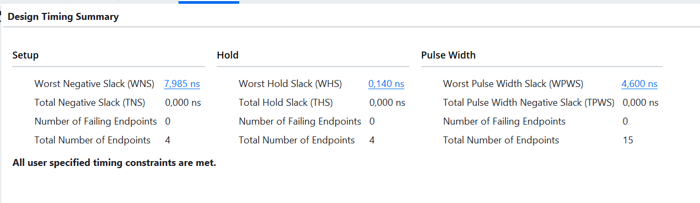
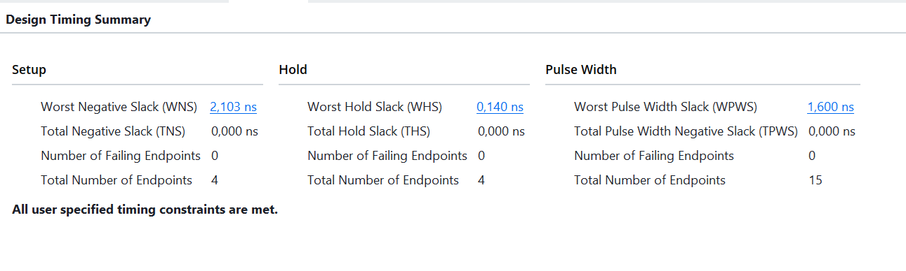

# Аналіз Timing Summary Report: отримання WNS

Частина 2 домашнього завдання після заняття 7. Мета — написати мінімальний
`.xdc`, запустити Implementation і отримати число WNS з вкладки Timing Summary.

Для аналізу взято лекційний приклад `alu.v` — його входи реєстрові
(`a_reg`, `b_reg`, `op_reg`), тому всі шляхи в дизайні є шляхами
регістр → регістр і мінімального констрейнта достатньо.

## Структура

```
lab3_alu_wns/
├── alu.xpr                                  -- проєкт Vivado
├── alu.srcs/sources_1/new/alu.v             -- модуль ALU
├── alu.srcs/constrs_1/new/alu_plain.xdc     -- констрейнт тактового сигналу
├── README.md
└── screenshots/
    ├── timing_10ns.png                      -- Timing Summary для періоду 10 нс
    └── timing_4ns.png                       -- Timing Summary для періоду 4 нс
```

Симуляція в цій частині не виконується: завдання охоплює лише Implementation і
читання звіту про часові характеристики.

## Констрейнт

Файл `alu_plain.xdc` містить рівно один рядок:

```tcl
create_clock -period 10.000 -name sys_clk [get_ports clk]
```

Число задається в наносекундах, без зазначення одиниці — вона береться з
налаштування `set_units -time`, яке за замовчуванням дорівнює `ns`.
Період 10 нс відповідає частоті 100 МГц.

Без цього рядка Vivado не знає, з якою частотою працює схема, і Timing Summary
показує `WNS = inf` замість реального числа.

Для другого запуску той самий рядок було змінено на `-period 4.000`.

## Результати

### Період 10 нс (100 МГц)



### Період 4 нс (250 МГц)



### Зведення

| Період | WNS       | WHS       | Failing endpoints | Затримка критичного шляху |
|--------|-----------|-----------|-------------------|---------------------------|
| 10 нс  | 7,985 нс  | 0,140 нс  | 0                 | 2,015 нс                  |
| 4 нс   | 2,103 нс  | 0,140 нс  | 0                 | 1,897 нс                  |

В обох випадках `TNS = 0` і жодна кінцева точка не порушує вимог — виводиться
повідомлення «All user specified timing constraints are met».

## Що показують ці числа

**WNS (Worst Negative Slack)** — найгірший запас за setup, тобто на скільки
раніше за потрібний момент дані встигають прийти на найповільнішому шляху.
Додатне значення означає, що вимога виконана.

Затримку критичного шляху обчислено як різницю періоду й WNS. При періоді 10 нс
вона становить 2,015 нс, що відповідає максимальній частоті близько 496 МГц.

**WHS (Worst Hold Slack)** не змінився між запусками — і це очікувано. Вимоги
hold не залежать від періоду тактового сигналу: вони визначаються тим, чи не
приходять дані на регістр *надто рано*, а не надто пізно.

**Спостереження щодо впливу констрейнта на результат.** Різниця WNS між
запусками становить 5,882 нс при різниці періодів 6 нс. Розбіжність у 0,118 нс
означає, що затримка критичного шляху не є сталою величиною: при жорсткішій
вимозі Vivado розмістив і розвів схему інакше, скоротивши шлях з 2,015 до
1,897 нс. Констрейнт не лише вимірює схему — він впливає на те, наскільки
старанно інструмент її оптимізує. За м'якої вимоги зусиль не докладається,
оскільки запас і так великий.

## Як відтворити

1. Відкрити `alu.xpr` у Vivado.
2. За потреби змінити період у `alu_plain.xdc`.
3. `Flow Navigator` → `Run Implementation` (саме Implementation, не Synthesis —
   на етапі синтезу реальних затримок трасування ще немає).
4. Після завершення відкрити вкладку Timing Summary або
   `Reports` → `Timing` → `Report Timing Summary`.

Перевірити, що констрейнт підхопився, можна командою `report_clocks` у Tcl
Console — вона покаже `sys_clk` із заданим періодом.