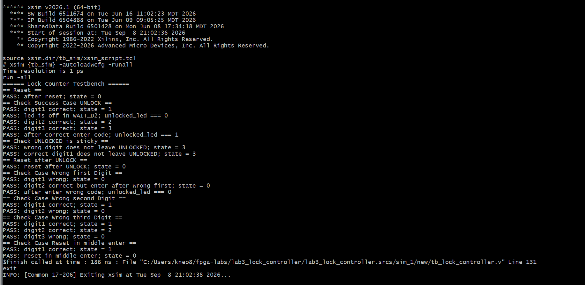

# Контролер замка (FSM, three-process pattern)

Частина 1 домашнього завдання після заняття 7. Кінцевий автомат на чотири стани,
що розблоковує вихід після введення правильної послідовності з трьох цифр.

Код замка: **7, 1, 2**.

## Структура

```
lab3_lock_controller/
├── lab3_lock_controller.srcs/sources_1/new/
│   ├── lock_controller.v       -- кінцевий автомат
│   ├── debounce.v              -- фільтр дребезгу для однієї лінії кнопки
│   └── lock_top.v              -- обгортка: фільтри + автомат
├── lab3_lock_controller.srcs/sim_1/new/
│   └── tb_lock_controller.v    -- testbench автомата
├── run_sim.sh                  -- збірка та запуск симуляції
├── README.md
└── screenshots/
    └── terminal.png            -- консольний вивід PASS/FAIL
```

## Модуль lock_controller

| Порт           | Напрямок | Розрядність | Призначення                        |
|----------------|----------|-------------|------------------------------------|
| `clk`          | input    | 1           | тактовий сигнал                    |
| `rst`          | input    | 1           | асинхронний скид, активний високим |
| `digit_in`     | input    | 4           | введена цифра                      |
| `unlocked_led` | output   | 1           | 1 — розблоковано                   |

Стани та код замка оголошено через `localparam`, а не через `` `define `` —
`localparam` має область видимості модуля і не може бути переозначений зовні,
на відміну від `parameter`.

| Стан       | Значення | Опис                              |
|------------|----------|-----------------------------------|
| `LOCKED`   | 0        | початковий стан                   |
| `WAIT_D2`  | 1        | введено першу цифру правильно     |
| `WAIT_D3`  | 2        | введено дві цифри правильно       |
| `UNLOCKED` | 3        | код введено повністю, вихід = 1   |

Неправильна цифра з будь-якого стану повертає автомат у `LOCKED`. У стані
`UNLOCKED` автомат залишається назавжди — вийти з нього можна лише скидом.

## Three-process pattern

Код розділено на **рівно три** `always`-блоки, кожен з однією відповідальністю:

**1. Реєстр стану.** Тактований блок, який лише копіює `next_state` у `state`.
Жодних рішень не приймає:

```verilog
always @(posedge clk or posedge rst) begin
    if (rst) state <= LOCKED;
    else     state <= next_state;
end
```

**2. Логіка переходів.** Комбінаційний блок, що обчислює `next_state` з
поточного стану та введеної цифри. Нічого не виводить назовні:

```verilog
always @(*) begin
    next_state = state;        // default assignment prevents latch inference
    case (state)
        ...
        default: next_state = LOCKED;
    endcase
end
```

Присвоєння `next_state = state` першим рядком і гілка `default` у `case`
забезпечують повне покриття умов. Це важливо саме в Verilog: блок `always @(*)`
не декларує намір описати комбінаційну логіку, тому синтезатор не попередить про
виведення засувки, як це зробив би `always_comb` у SystemVerilog. Дисципліну
доводиться тримати вручну.

**3. Логіка виходу.** Комбінаційний блок, що обчислює `unlocked_led` лише з
поточного стану, переходами не займається:

```verilog
always @(*) begin
    unlocked_led = (state == UNLOCKED);
end
```

Розділення на три блоки й перевіряється завданням: кожна відповідальність живе
окремо, і жоден блок не робить роботу іншого.

## Фільтр дребезгу

Фільтр інстанціюється **між фізичною кнопкою та входом автомата**, а не
всередині нього — тому `lock_controller` залишається з трьома блоками, а
фільтрація виконується в обгортці `lock_top`:

```verilog
debounce d0 (.clk(clk), .rst(rst), .btn_raw(digit_raw[0]), .btn_clean(digit_clean[0]));
// ... d1, d2, d3 for the remaining bits
lock_controller fsm (.clk(clk), .rst(rst), .digit_in(digit_clean), .unlocked_led(unlocked_led));
```

Оскільку фільтр працює з однією лінією, а `digit_in` чотирирозрядний, потрібно
чотири екземпляри.

Усередині фільтра поєднано два різні механізми:

- **Двокаскадний синхронізатор** — сигнал з фізичного піна асинхронний відносно
  `clk`, і його безпосереднє защіпування може призвести до метастабільності.
- **Лічильник стабільності** — вихід змінюється лише після того, як вхід
  протримався відмінним від виходу протягом `COUNT_MAX` тактів підряд.

Це різні проблеми: синхронізатор не прибирає дребезг, а лічильник не прибирає
метастабільність.

Розрядність лічильника виводиться з параметра через `$clog2`, тому
переозначення `COUNT_MAX` не може призвести до непомітного переповнення.
За замовчуванням `COUNT_MAX = 200_000`, що на частоті 100 МГц дає 2 мс —
з запасом покриває типовий дребезг механічної кнопки.

## Testbench

Автомат тестується напряму, без обгортки та фільтрів — так тест ізольований і
швидкий.

Оскільку `state` не є портом модуля, testbench звертається до нього іерархічно
(`dut.state`). Так само беруться і константи (`dut.WAIT_D2`, `dut.DIGIT1`):
якщо кодування станів у модулі зміниться, тест не розійдеться з ним.

Перевірки зведено в задачі: `check_transition` подає цифру, чекає фронт і
порівнює стан; `log_transition` лише порівнює й виводить; `check_unlocked_led`
перевіряє вихід; `reset_lock_counter` виконує скид.

## Перелік перевірок

| Сценарій                              | Що підтверджує                        |
|---------------------------------------|---------------------------------------|
| скид                                  | початковий стан `LOCKED`              |
| 7 → 1 → 2                             | кожен перехід окремо, до `UNLOCKED`   |
| вихід у `UNLOCKED`                    | `unlocked_led = 1`                    |
| цифра у `UNLOCKED`                    | стан не змінюється (sticky)           |
| неправильна перша цифра               | повернення в `LOCKED`                 |
| неправильна друга цифра               | повернення в `LOCKED`                 |
| неправильна третя цифра               | повернення в `LOCKED`                 |
| скид посеред введення                 | повернення в `LOCKED`                 |
| вихід у `LOCKED`                      | `unlocked_led = 0`                    |

Перевірка неправильної другої цифри після неправильної першої окремо
підтверджує, що автомат не «згадує» правильні цифри після помилки.

## Запуск

```bash
./run_sim.sh          # консольний режим, вивід PASS/FAIL
./run_sim.sh gui      # відкриває Waveform у XSim
```

Еквівалентні команди вручну:

```bash
xvlog lock_controller.v tb_lock_controller.v
xelab tb_lock_controller -s tb_sim
xsim tb_sim -R
```

Прапорець `-sv` не потрібен: код написано на Verilog, тип `string` не
використовується — назви кроків передаються як упаковані вектори
(`input [8*64-1:0] name`).

## Результат



Усі перевірки завершуються результатом PASS.